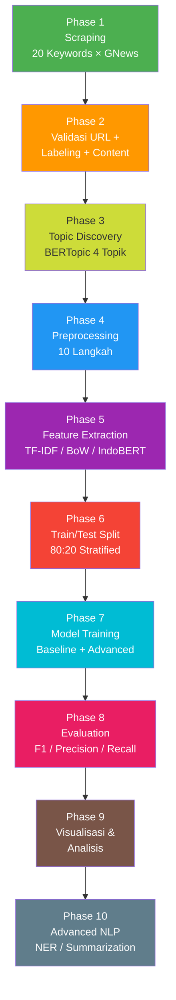
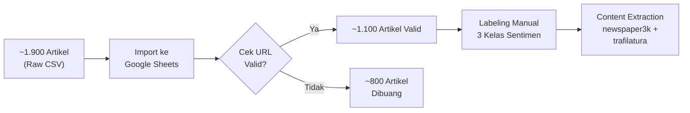
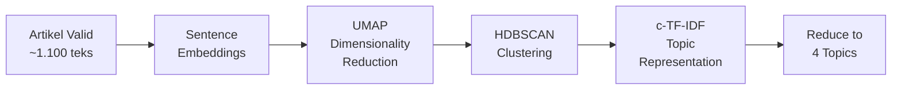
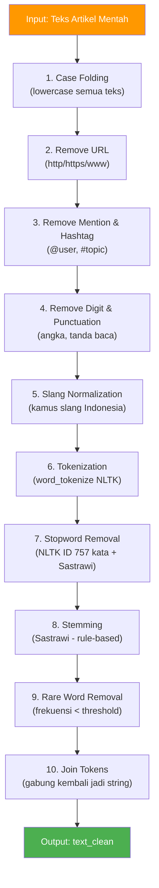

# Pipeline End-to-End: Analisis Sentimen Artikel LPDP

## Daftar Isi

- [Gambaran Umum](#gambaran-umum)
- [Alur Pipeline](#alur-pipeline)
- [Checklist dan Pembagian Tugas](#checklist-dan-pembagian-tugas)
- [Phase 1: Data Collection (Scraping)](#phase-1-data-collection-scraping)
- [Phase 2: Data Validation dan Labeling](#phase-2-data-validation-dan-labeling)
- [Phase 3: Topic Discovery (BERTopic)](#phase-3-topic-discovery-bertopic)
- [Phase 4: Preprocessing](#phase-4-preprocessing)
- [Phase 5: Feature Extraction](#phase-5-feature-extraction)
- [Phase 6: Train/Test Split](#phase-6-traintest-split)
- [Phase 7: Model Training](#phase-7-model-training)
- [Phase 8: Evaluation Metrics](#phase-8-evaluation-metrics)
- [Phase 9: Visualization dan Analisis](#phase-9-visualization-dan-analisis)
- [Phase 10: Advanced NLP Tasks (Opsional)](#phase-10-advanced-nlp-tasks-opsional)
- [Tech Stack](#tech-stack)
- [Referensi Notebook](#referensi-notebook)

---

## Gambaran Umum

| Item | Detail |
| :--- | :--- |
| **Tujuan** | Mengklasifikasikan sentimen artikel berita LPDP (Positive / Negative / Neutral) menggunakan teknik NLP |
| **Bahasa** | Indonesia |
| **Sumber Data** | Google News RSS via library GNews |
| **Jumlah Artikel Scraped** | ~1.900 artikel |
| **Jumlah Artikel Valid** | ~1.100 artikel (setelah validasi URL manual) |
| **Labeling** | Manual di Google Sheets (3 kelas: Positive, Negative, Neutral) |
| **Output Akhir** | Model klasifikasi sentimen + laporan evaluasi performa |

---

## Alur Pipeline



---

## Checklist dan Pembagian Tugas

### Pembagian PIC per Phase

| PIC | Phase Utama | Tanggung Jawab |
| :--- | :--- | :--- |
| **Iqbal** | Phase 1, 3 | Scraping GNews, BERTopic topic discovery, pipeline doc |
| **Ratna** | Phase 4 | Preprocessing 10 langkah, kamus slang |
| **Celine** | Phase 5, 6 | Feature extraction (TF-IDF/BoW/IndoBERT), train/test split |
| **Salwa** | Phase 7, 8 | Model training (baseline + IndoBERT), evaluation metrics |
| **Nida** | Phase 9, 10 | Visualization, advanced NLP (NER, summarization) |
| **Semua** | Phase 2 | Validasi URL + labeling manual (~220 artikel/orang) |

### Checklist Detail

- [x] **Phase 1 — Scraping** (PIC: Iqbal)
  - [x] Konfigurasi 20 keywords GNews
  - [ ] Jalankan scraping + deduplikasi
  - [x] Export `dataset_lpdp_sorted.csv`
- [ ] **Phase 2 — Validasi dan Labeling** (PIC: Semua)
  - [ ] Import CSV ke Google Sheets
  - [ ] Iqbal: validasi + labeling baris 1–220
  - [ ] Ratna: validasi + labeling baris 221–440
  - [ ] Celine: validasi + labeling baris 441–660
  - [ ] Salwa: validasi + labeling baris 661–880
  - [ ] Nida: validasi + labeling baris 881–1100
  - [ ] Rekonsiliasi label antar annotator
  - [ ] Scraping konten artikel (`newspaper3k` + `trafilatura`)
  - [ ] Validasi coverage content ≥ 85%
  - [ ] Fallback `Deskripsi` untuk URL gagal
- [ ] **Phase 3 — BERTopic** (PIC: Iqbal, Ratna)
  - [ ] Install BERTopic + sentence-transformers
  - [ ] Fit model pada artikel valid
  - [ ] Reduce ke 4 topik utama
  - [ ] Visualisasi dan interpretasi topik
- [ ] **Phase 4 — Preprocessing** (PIC: Ratna)
  - [ ] Implementasi pipeline 10 langkah
  - [ ] Buat kamus slang Indonesia
  - [ ] Validasi output `text_clean`
- [ ] **Phase 5 — Feature Extraction** (PIC: Celine)
  - [ ] TF-IDF vectorization (unigram + bigram)
  - [ ] Bag of Words baseline
  - [ ] IndoBERT embeddings ([CLS] token)
- [ ] **Phase 6 — Train/Test Split** (PIC: Celine)
  - [ ] Stratified split 80:20
  - [ ] Verifikasi distribusi label di train dan test
- [ ] **Phase 7 — Model Training** (PIC: Salwa)
  - [ ] Tier 1: Naive Bayes, Logistic Regression, Linear SVC
  - [ ] Tier 2: IndoBERT fine-tuning (5 epoch)
- [ ] **Phase 8 — Evaluation** (PIC: Salwa)
  - [ ] Classification report per model
  - [ ] Confusion matrix visualization
  - [ ] Perbandingan F1 weighted antar model
- [ ] **Phase 9 — Visualization** (PIC: Nida)
  - [ ] Distribusi sentimen (bar chart)
  - [ ] Word cloud per sentimen
  - [ ] Tren temporal + sentimen per media
- [ ] **Phase 10 — Advanced NLP** (PIC: Nida, Iqbal)
  - [ ] NER dengan IndoBERT-NER
  - [ ] Extractive summarization

---

## Phase 1: Data Collection (Scraping)

### Library

- **GNews** — Python wrapper untuk Google News RSS feed
- Konfigurasi: `language='id'`, `country='ID'`, `max_results=500`

### Strategi 20 Keywords (5 Kategori)

| Kategori | Keywords |
| :--- | :--- |
| **General** | `LPDP`, `Beasiswa+LPDP`, `Program+LPDP` |
| **Aktor** | `Awardee+LPDP`, `Alumni+LPDP`, `Mahasiswa+LPDP`, `Penerima+LPDP` |
| **Konteks** | `Polemik+LPDP`, `Wawancara+LPDP`, `Pendaftar+LPDP`, `Seleksi+LPDP` |
| **Cakupan** | `LPDP+Luar+Negeri`, `LPDP+S2`, `LPDP+S3`, `Kuliah+LPDP` |
| **Waktu** | `LPDP+2024`, `LPDP+2023` |
| **Campuran** | `Dana+LPDP`, `LPDP+Indonesia`, `Scholarship+LPDP` |

### Proses

1. Loop 20 keywords, masing-masing fetch hingga 500 hasil (delay 2 detik antar query)
2. Gabungkan semua hasil ke satu DataFrame
3. **Deduplikasi** berdasarkan kolom `URL_Artikel`
4. Sort berdasarkan `Sumber_Media` dan `Tanggal_Rilis` (terbaru di atas)
5. Export ke CSV

### Output

- File: `dataset_lpdp_sorted.csv`
- Kolom: `Judul`, `Tanggal_Rilis`, `Deskripsi`, `URL_Artikel`, `Sumber_Media`, `Tanggal_Parsed`
- Total: ~1.900 artikel (sebelum validasi)

---

## Phase 2: Data Validation dan Labeling

### Mengapa Perlu Validasi?

Dari ~1.900 artikel yang di-scrape, banyak URL yang sudah **mati, redirect, atau duplikat konten**. Proses validasi dilakukan manual di Google Sheets.

### Proses Validasi



### Kriteria Validasi

| Status | Kriteria |
| :--- | :--- |
| **Valid** | URL bisa diakses, konten relevan tentang LPDP, bukan duplikat |
| **Invalid** | URL mati (404/403), redirect ke homepage, konten tidak relevan, video-only |

### Labeling Manual

Setiap artikel yang valid diberi label sentimen berdasarkan **nada keseluruhan** artikel:

| Label | Deskripsi | Contoh Topik |
| :--- | :--- | :--- |
| **Positive** | Artikel bernada positif, apresiatif, atau informatif-netral-positif | Kisah sukses alumni, pembukaan pendaftaran baru |
| **Negative** | Artikel bernada kritis, negatif, atau kontroversial | Polemik paspor, pelanggaran kontrak, kritik publik |
| **Neutral** | Artikel informatif murni tanpa tendensi emosional | Pengumuman resmi, data statistik, FAQ |

### Content Extraction (Scraping Isi Artikel)

Google News RSS hanya menyediakan **deskripsi singkat** (1–2 kalimat snippet). Untuk analisis NLP yang mendalam (BERTopic, sentimen, NER), diperlukan **isi lengkap** artikel dari setiap URL valid.

#### Kenapa Perlu Content Extraction?

| Data | Sumber | Panjang Rata-rata | Kualitas untuk NLP |
| :--- | :--- | :--- | :--- |
| `Deskripsi` | Google News RSS snippet | ~20–50 kata | Kurang — terlalu pendek |
| `Content` | Scraping dari URL asli | ~200–1.000 kata | Baik — paragraf lengkap |

#### Library Ekstraksi Konten

| Library | Keunggulan |
| :--- | :--- |
| **newspaper3k** | Otomatis extract judul, teks, tanggal; support multi-bahasa |
| **trafilatura** | Lebih robust untuk edge case (paywall, JS-rendered) |

#### Implementasi Ekstraksi Konten

```python
from newspaper import Article
import time


def extract_article_content(url, lang='id', timeout=10):
    """Extract full article text from URL."""
    try:
        article = Article(url, language=lang, request_timeout=timeout)
        article.download()
        article.parse()
        return article.text if len(article.text) > 50 else None
    except Exception:
        return None


# Scrape konten dari semua artikel valid
contents = []
for idx, url in enumerate(df_valid['URL_Artikel']):
    content = extract_article_content(url)
    contents.append(content)
    if idx % 50 == 0:
        print(f"Progress: {idx}/{len(df_valid)}")
    time.sleep(1)  # Rate limiting: 1 detik antar request

df_valid['Content'] = contents

# Cek coverage
success_rate = df_valid['Content'].notna().mean()
print(f"Content extracted: {success_rate:.1%}")
```

#### Fallback dengan Trafilatura

```python
import trafilatura


def extract_with_trafilatura(url):
    """Fallback untuk URL yang gagal di newspaper3k."""
    try:
        downloaded = trafilatura.fetch_url(url)
        return trafilatura.extract(downloaded) if downloaded else None
    except Exception:
        return None


# Isi yang masih kosong dengan trafilatura
mask_empty = df_valid['Content'].isna()
df_valid.loc[mask_empty, 'Content'] = (
    df_valid.loc[mask_empty, 'URL_Artikel'].apply(extract_with_trafilatura)
)
```

#### Validasi Content

| Metric | Target |
| :--- | :--- |
| **Coverage** | ≥ 85% artikel valid punya content |
| **Min length** | ≥ 50 karakter (filter noise) |
| **Fallback** | Artikel tanpa content → gunakan `Deskripsi` |

```python
# Fallback: gunakan Deskripsi jika Content tetap kosong
df_valid['Content'] = df_valid['Content'].fillna(df_valid['Deskripsi'])

# Statistik panjang content
df_valid['content_len'] = df_valid['Content'].str.len()
print(df_valid['content_len'].describe())
```

### Output Phase 2

- Spreadsheet dengan kolom tambahan: `PIC`, `Valid?`, `Sentiment`, `Content`, `Notes`
- Kolom `Content`: isi lengkap artikel (paragraf/kalimat) dari URL asli
- Dataset final: ~1.100 artikel berlabel + konten siap diproses

### Distribusi Label (Estimasi Umum Artikel Berita)

> **Catatan:** Distribusi aktual perlu dihitung dari data final. Pola umum artikel berita:

| Label | Estimasi Proporsi |
| :--- | :--- |
| Neutral | ~50-60% |
| Negative | ~25-30% |
| Positive | ~15-20% |

**Implikasi:** Class imbalance ini akan memengaruhi strategi split dan metrik evaluasi (lihat Phase 6 dan 8).

---

## Phase 3: Topic Discovery (BERTopic)

### Tujuan

Mengelompokkan ~1.100 artikel valid ke dalam **4 topik utama** menggunakan BERTopic untuk memahami tema dominan sebelum analisis sentimen.

### Kenapa BERTopic, Bukan LDA?

| Aspek | LDA (Tradisional) | BERTopic |
| :--- | :--- | :--- |
| **Representasi teks** | Bag-of-words | Contextual embeddings (transformer) |
| **Kualitas topik** | Sering tercampur | Lebih koheren dan interpretable |
| **Bahasa Indonesia** | Terbatas | Didukung via multilingual model |
| **Visualisasi** | Manual (matplotlib) | Built-in (interaktif) |
| **Tuning** | Banyak hyperparameter | Minimal, otomatis |

### Pipeline BERTopic



### Implementasi

```python
from bertopic import BERTopic
from sentence_transformers import SentenceTransformer

# 1. Embedding model multilingual (support Bahasa Indonesia)
embedding_model = SentenceTransformer(
    "sentence-transformers/paraphrase-multilingual-MiniLM-L12-v2"
)

# 2. Inisialisasi BERTopic dengan target 4 topik
topic_model = BERTopic(
    embedding_model=embedding_model,
    nr_topics=4,
    language="indonesian",
    calculate_probabilities=True,
    verbose=True
)

# 3. Fit pada teks artikel valid (gunakan Content, bukan Deskripsi)
docs = df_valid['Content'].tolist()
topics, probs = topic_model.fit_transform(docs)

# 4. Lihat ringkasan topik
print(topic_model.get_topic_info())

# 5. Top words per topik
for topic_id in range(4):
    print(f"\nTopic {topic_id}:")
    print(topic_model.get_topic(topic_id))
```

### 4 Topik Utama (Estimasi)

Berdasarkan domain artikel LPDP, BERTopic diharapkan menemukan cluster berikut:

| Topik | Tema | Contoh Keywords |
| :--- | :--- | :--- |
| **Topic 0** | Beasiswa dan Pendaftaran | `pendaftaran`, `persyaratan`, `seleksi`, `kuota`, `jadwal` |
| **Topic 1** | Alumni dan Prestasi | `alumni`, `karier`, `sukses`, `kontribusi`, `pengabdian` |
| **Topic 2** | Kebijakan dan Polemik | `kebijakan`, `anggaran`, `polemik`, `paspor`, `kontrak` |
| **Topic 3** | Akademik dan Riset | `universitas`, `penelitian`, `publikasi`, `kampus`, `studi` |

> **Catatan:** Label topik di atas adalah estimasi awal. BERTopic menentukan cluster secara otomatis berdasarkan kesamaan semantik — nama topik perlu diinterpretasi dari top words yang dihasilkan model.

### Visualisasi Topik

```python
# Bar chart: top words per topik
topic_model.visualize_barchart(top_n_topics=4, n_words=10)

# Intertopic Distance Map (kesamaan antar topik)
topic_model.visualize_topics()

# Distribusi probabilitas dokumen ke topik
topic_model.visualize_distribution(probs[0])

# Heatmap similarity antar topik
topic_model.visualize_heatmap()
```

### Output Phase 3

- Kolom baru di DataFrame: `topic_id` (0–3) dan `topic_label`
- Visualisasi topik untuk laporan akhir
- Insight: distribusi sentimen **per topik** (cross-analysis di Phase 9)

---

## Phase 4: Preprocessing

### Pipeline 10 Langkah



### Detail Tiap Langkah

| Step | Teknik | Library | Contoh |
| :--- | :--- | :--- | :--- |
| 1 | Case folding | Python `str.lower()` | `"Alumni LPDP"` → `"alumni lpdp"` |
| 2 | Remove URL | `re.sub(r'https?://\S+', '')` | Hapus link dalam teks |
| 3 | Remove mention/hashtag | `re.sub(r'[@#]\w+', '')` | `"@kompas #LPDP"` → `""` |
| 4 | Remove digit & punctuation | `re.sub`, `string.punctuation` | `"tahun 2024!"` → `"tahun"` |
| 5 | Slang normalization | Kamus custom (CSV) | `"gak"` → `"tidak"`, `"bgt"` → `"banget"` |
| 6 | Tokenization | `nltk.word_tokenize()` | `"alumni lpdp sukses"` → `["alumni", "lpdp", "sukses"]` |
| 7 | Stopword removal | NLTK Indonesian (757 kata) + Sastrawi | Hapus: `"yang"`, `"dan"`, `"di"`, `"ini"` |
| 8 | Stemming | `Sastrawi.StemmerFactory` | `"pendidikan"` → `"didik"`, `"penerima"` → `"terima"` |
| 9 | Rare word removal | Frequency threshold (< 2) | Hapus kata yang muncul hanya 1× di seluruh korpus |
| 10 | Join tokens | `' '.join(tokens)` | `["alumni", "lpdp"]` → `"alumni lpdp"` |

### Catatan untuk Bahasa Indonesia

- **Sastrawi** lebih cocok daripada Porter/Snowball karena memahami morfologi Indonesia (imbuhan me-, di-, ke-an, pe-an, dll.)
- **Slang dictionary** penting karena artikel berita sering mengutip komentar netizen yang mengandung bahasa informal
- **Stopword list** perlu di-augment dengan domain-specific stopwords jika ditemukan noise berulang

---

## Phase 5: Feature Extraction

### Pendekatan yang Digunakan

#### A. TF-IDF (Term Frequency - Inverse Document Frequency)

> **Rekomendasi utama** untuk baseline model (SVM, Logistic Regression, Naive Bayes)

```python
from sklearn.feature_extraction.text import TfidfVectorizer

tfidf = TfidfVectorizer(
    max_features=5000,      # Batasi fitur
    ngram_range=(1, 2),     # Unigram + Bigram
    min_df=2,               # Minimal muncul di 2 dokumen
    max_df=0.95,            # Abaikan kata yang muncul di 95%+ dokumen
    sublinear_tf=True       # Logarithmic TF scaling
)
X_tfidf = tfidf.fit_transform(df['text_clean'])
```

**Keunggulan:** Cepat, interpretable, proven untuk klasifikasi teks Indonesia.

#### B. Bag of Words (BoW)

> Baseline paling sederhana untuk perbandingan

```python
from sklearn.feature_extraction.text import CountVectorizer

bow = CountVectorizer(max_features=5000, ngram_range=(1, 2))
X_bow = bow.fit_transform(df['text_clean'])
```

#### C. IndoBERT Embeddings

> **Rekomendasi untuk advanced model** — contextual embeddings dari pre-trained transformer

```python
from transformers import AutoTokenizer, AutoModel
import torch

model_name = "indobenchmark/indobert-base-p1"
tokenizer = AutoTokenizer.from_pretrained(model_name)
model = AutoModel.from_pretrained(model_name)

# Encode teks → ambil [CLS] token sebagai representasi dokumen
inputs = tokenizer(text, return_tensors="pt", truncation=True, max_length=512)
with torch.no_grad():
    outputs = model(**inputs)
embedding = outputs.last_hidden_state[:, 0, :]  # [CLS] token
```

### Perbandingan Pendekatan

| Aspek | TF-IDF | BoW | IndoBERT |
| :--- | :--- | :--- | :--- |
| **Kecepatan** | Cepat | Sangat cepat | Lambat (perlu GPU) |
| **Konteks** | Tidak (bag-of-words) | Tidak | Ya (contextual) |
| **Interpretability** | Tinggi | Tinggi | Rendah |
| **Akurasi** | Baik | Cukup | Terbaik |
| **Cocok untuk** | SVM, LR, NB | Baseline | Fine-tuning / transfer learning |

---

## Phase 6: Train/Test Split

### Mengapa Perlu Split?

- **Tanpa split** → model dievaluasi pada data yang sama dengan training → **overfitting**, metrik tidak reliable
- **Dengan split** → evaluasi pada data yang belum pernah dilihat model → estimasi performa di dunia nyata

### Strategi Split

```python
from sklearn.model_selection import train_test_split

X_train, X_test, y_train, y_test = train_test_split(
    X,                    # Fitur (TF-IDF / BoW / embeddings)
    y,                    # Label sentimen
    test_size=0.2,        # 20% untuk testing
    random_state=42,      # Reproducibility
    stratify=y            # PENTING: jaga proporsi label
)
```

### Kenapa Stratified?

Karena distribusi label **tidak seimbang** (Neutral dominan):

```text
Distribusi sebelum split:
  Neutral  : 600 (55%)    →  Train: 480  |  Test: 120
  Negative : 300 (27%)    →  Train: 240  |  Test:  60
  Positive : 200 (18%)    →  Train: 160  |  Test:  40

Tanpa stratify → Test set bisa kebetulan berisi 90% Neutral → evaluasi misleading
Dengan stratify → Proporsi 55:27:18 terjaga di train DAN test
```

### Cross-Validation (Opsional tapi Direkomendasikan)

```python
from sklearn.model_selection import StratifiedKFold, cross_val_score

skf = StratifiedKFold(n_splits=5, shuffle=True, random_state=42)
scores = cross_val_score(model, X_train, y_train, cv=skf, scoring='f1_weighted')
print(f"CV F1 (weighted): {scores.mean():.4f} ± {scores.std():.4f}")
```

**Kenapa 5-Fold CV?**

- Memberikan estimasi performa yang lebih stabil
- Memanfaatkan semua data training untuk validasi (setiap fold jadi validation set sekali)
- Mendeteksi apakah model overfit ke split tertentu

---

## Phase 7: Model Training

### Tier 1: Baseline Models (Classical ML + TF-IDF)

| Model | Library | Karakteristik |
| :--- | :--- | :--- |
| **Multinomial Naive Bayes** | `sklearn.naive_bayes` | Cepat, cocok untuk sparse features, baseline yang solid |
| **Logistic Regression** | `sklearn.linear_model` | Interpretable, performa stabil, regularization built-in |
| **Linear SVC** | `sklearn.svm` | Biasanya **terbaik** untuk klasifikasi teks dengan TF-IDF |

```python
from sklearn.naive_bayes import MultinomialNB
from sklearn.linear_model import LogisticRegression
from sklearn.svm import LinearSVC

models = {
    'Naive Bayes': MultinomialNB(alpha=1.0),
    'Logistic Regression': LogisticRegression(
        C=1.0, max_iter=1000, class_weight='balanced'
    ),
    'Linear SVC': LinearSVC(
        C=1.0, max_iter=1000, class_weight='balanced'
    )
}

for name, model in models.items():
    model.fit(X_train, y_train)
    y_pred = model.predict(X_test)
    print(f"\n{name}")
    print(classification_report(y_test, y_pred))
```

> **`class_weight='balanced'`** — otomatis menyesuaikan bobot kelas yang under-represented. Penting untuk menangani imbalance Neutral vs Positive/Negative.

### Tier 2: Advanced Model (IndoBERT Fine-Tuning)

```python
from transformers import (
    AutoTokenizer,
    AutoModelForSequenceClassification,
    Trainer,
    TrainingArguments
)

model_name = "indobenchmark/indobert-base-p1"
tokenizer = AutoTokenizer.from_pretrained(model_name)
model = AutoModelForSequenceClassification.from_pretrained(
    model_name,
    num_labels=3  # Positive, Negative, Neutral
)

training_args = TrainingArguments(
    output_dir="./results",
    num_train_epochs=5,
    per_device_train_batch_size=16,
    per_device_eval_batch_size=32,
    learning_rate=2e-5,
    weight_decay=0.01,
    eval_strategy="epoch",
    save_strategy="epoch",
    load_best_model_at_end=True,
    metric_for_best_model="f1_weighted"
)

trainer = Trainer(
    model=model,
    args=training_args,
    train_dataset=train_dataset,
    eval_dataset=eval_dataset,
    compute_metrics=compute_metrics
)

trainer.train()
```

### Perbandingan Ekspektasi Performa

| Model | Estimasi F1 (weighted) | Waktu Training | Hardware |
| :--- | :--- | :--- | :--- |
| Naive Bayes + TF-IDF | 0.65 - 0.75 | Detik | CPU |
| Logistic Regression + TF-IDF | 0.70 - 0.80 | Detik | CPU |
| Linear SVC + TF-IDF | 0.72 - 0.82 | Detik | CPU |
| IndoBERT Fine-Tuned | 0.80 - 0.90 | 30-60 menit | GPU (direkomendasikan) |

---

## Phase 8: Evaluation Metrics

### Metrik Utama

| Metrik | Formula | Interpretasi |
| :--- | :--- | :--- |
| **Accuracy** | $\frac{TP + TN}{Total}$ | Proporsi prediksi yang benar secara keseluruhan |
| **Precision** | $\frac{TP}{TP + FP}$ | Dari yang diprediksi kelas X, berapa yang benar? |
| **Recall** | $\frac{TP}{TP + FN}$ | Dari semua data kelas X, berapa yang terdeteksi? |
| **F1-Score** | $\frac{2 \times P \times R}{P + R}$ | Harmonic mean antara Precision dan Recall |

### Kenapa F1-Score Weighted?

Karena dataset **imbalanced** (Neutral dominan), accuracy saja bisa misleading:

```text
Contoh: 100 data test → 55 Neutral, 27 Negative, 18 Positive

Model bodoh yang SELALU prediksi "Neutral":
  Accuracy = 55/100 = 55% → "Lumayan"?
  F1 Positive = 0%
  F1 Negative = 0%
  F1 Weighted = rendah → Ekspos kelemahan model
```

**F1 Weighted** memberikan bobot berdasarkan jumlah sampel tiap kelas, sehingga kelas minoritas tetap diperhitungkan.

### Confusion Matrix

```python
from sklearn.metrics import (
    classification_report,
    confusion_matrix,
    ConfusionMatrixDisplay
)

# Classification Report (per-class P, R, F1)
print(classification_report(
    y_test, y_pred,
    target_names=['Negative', 'Neutral', 'Positive']
))

# Confusion Matrix Visual
cm = confusion_matrix(y_test, y_pred, labels=['Negative', 'Neutral', 'Positive'])
disp = ConfusionMatrixDisplay(cm, display_labels=['Negative', 'Neutral', 'Positive'])
disp.plot(cmap='Blues')
```

### Interpretasi Confusion Matrix (Contoh)

```text
                 Predicted
              Neg   Neu   Pos
Actual Neg  [ 45    12     3 ]   ← 45 benar, 15 salah klasifikasi
Actual Neu  [  8   105     7 ]   ← 105 benar
Actual Pos  [  2     5    33 ]   ← 33 benar

Baca per baris: "Dari 60 artikel Negative, 45 berhasil diprediksi benar"
Baca per kolom: "Dari 55 yang diprediksi Negative, 45 memang benar Negative"
```

### Metrik Tambahan

| Metrik | Kegunaan |
| :--- | :--- |
| **Macro F1** | Rata-rata F1 semua kelas (tanpa bobot) — sensitif terhadap kelas minoritas |
| **Cohen's Kappa** | Mengukur agreement di atas chance — lebih informatif dari accuracy untuk multiclass |
| **ROC-AUC (One-vs-Rest)** | Kemampuan discriminasi model per kelas |

---

## Phase 9: Visualization dan Analisis

### A. Distribusi Sentimen

```python
import matplotlib.pyplot as plt
import seaborn as sns

sns.countplot(data=df, x='Sentiment', order=['Positive', 'Neutral', 'Negative'],
              palette=['#4CAF50', '#2196F3', '#F44336'])
plt.title('Distribusi Sentimen Artikel LPDP')
plt.ylabel('Jumlah Artikel')
```

### B. Word Cloud per Sentimen

```python
from wordcloud import WordCloud

for sentiment in ['Positive', 'Negative', 'Neutral']:
    text = ' '.join(df[df['Sentiment'] == sentiment]['text_clean'])
    wc = WordCloud(width=800, height=400, background_color='white').generate(text)
    plt.figure(figsize=(10, 5))
    plt.imshow(wc, interpolation='bilinear')
    plt.title(f'Word Cloud - {sentiment}')
    plt.axis('off')
```

### C. Top Keywords per Kelas (TF-IDF)

Ekstrak 10 kata dengan skor TF-IDF tertinggi per kelas sentimen untuk memahami kata-kata pembeda antar kelas.

### D. Tren Sentimen Temporal

```python
df['month'] = df['Tanggal_Parsed'].dt.to_period('M')
trend = df.groupby(['month', 'Sentiment']).size().unstack(fill_value=0)
trend.plot(kind='line', marker='o', figsize=(12, 5))
plt.title('Tren Sentimen Artikel LPDP per Bulan')
plt.ylabel('Jumlah Artikel')
```

### E. Sentimen per Sumber Media

```python
media_sentiment = pd.crosstab(df['Sumber_Media'], df['Sentiment'], normalize='index')
media_sentiment.plot(kind='barh', stacked=True, figsize=(10, 8),
                     color=['#F44336', '#2196F3', '#4CAF50'])
plt.title('Proporsi Sentimen per Sumber Media')
```

---

## Phase 10: Advanced NLP Tasks (Opsional)

### A. Named Entity Recognition (NER)

Mengidentifikasi entitas bernama (orang, organisasi, lokasi) dalam artikel LPDP.

```python
from transformers import pipeline

ner_pipeline = pipeline(
    "ner",
    model="cahya/bert-base-indonesian-NER",
    tokenizer="cahya/bert-base-indonesian-NER",
    aggregation_strategy="simple"
)

entities = ner_pipeline("Alumni LPDP dari Universitas Indonesia mendapat beasiswa S2 di MIT")
# Output: [{'entity_group': 'PER', 'word': 'Alumni LPDP'},
#          {'entity_group': 'ORG', 'word': 'Universitas Indonesia'},
#          {'entity_group': 'ORG', 'word': 'MIT'}]
```

### B. Topic Modeling

> Sudah dicakup secara mendalam di **Phase 3 (BERTopic)** menggunakan contextual embeddings. Lihat [Phase 3: Topic Discovery](#phase-3-topic-discovery-bertopic) untuk implementasi lengkap.

### C. Extractive Summarization

Meringkas artikel panjang menggunakan metode TF-IDF sentence scoring.

```python
# Hitung TF-IDF per kalimat → score → ambil top-N kalimat sebagai ringkasan
sentences = nltk.sent_tokenize(article_text)
sentence_scores = tfidf_sentence_scoring(sentences)
summary = select_top_sentences(sentence_scores, ratio=0.3)
```

---

## Tech Stack

### Libraries

| Kategori | Library | Versi |
| :--- | :--- | :--- |
| **Scraping** | GNews, newspaper3k, trafilatura | Latest |
| **Data** | pandas, numpy | Latest |
| **Preprocessing** | NLTK, Sastrawi, regex | Latest |
| **Feature Extraction** | scikit-learn (TfidfVectorizer) | Latest |
| **ML Models** | scikit-learn (SVM, LR, NB) | Latest |
| **Deep Learning** | transformers, torch | Latest |
| **Topic Modeling** | BERTopic, sentence-transformers, UMAP, HDBSCAN | Latest |
| **NER** | transformers (cahya/bert-base-indonesian-NER) | Latest |
| **Visualization** | matplotlib, seaborn, wordcloud | Latest |

### Pre-trained Models

| Model | Kegunaan | Source |
| :--- | :--- | :--- |
| `indobenchmark/indobert-base-p1` | Fine-tuning klasifikasi sentimen | HuggingFace |
| `cahya/bert-base-indonesian-NER` | Named Entity Recognition Indonesia | HuggingFace |

### Hardware Requirement

| Task | Minimum | Rekomendasi |
| :--- | :--- | :--- |
| Preprocessing + Baseline ML | CPU, 4GB RAM | CPU, 8GB RAM |
| IndoBERT Fine-Tuning | GPU 4GB VRAM | GPU 8GB+ VRAM (T4/V100) |

---

## Referensi Notebook

| Notebook | Relevansi |
| :--- | :--- |
| `Project A/ScrappingArtikelLPDP.ipynb` | Kode scraping 20 keywords |
| `Week 2/Preprocessing.ipynb` | Pipeline preprocessing 10 langkah |
| `Week 3/Tugas1C_LPDP_Article_Summarization.ipynb` | Summarization TF-IDF pada artikel LPDP |
| `Week 4/Tugas1_TFIDF_SentimentClassification.ipynb` | TF-IDF + model klasifikasi sentimen |
| `Week 6/SentimentAnalysis.ipynb` | Sentiment analysis dengan TextBlob + visualisasi |
| `Week 6/NER.ipynb` | NER dengan spaCy dan IndoBERT |
| `Week 6/Clustering.ipynb` | KMeans clustering + TF-IDF |
| `Week 7/Week7_NER_HonestReview.ipynb` | NER pada dataset review Indonesia |
