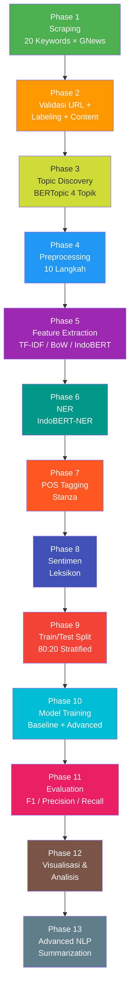
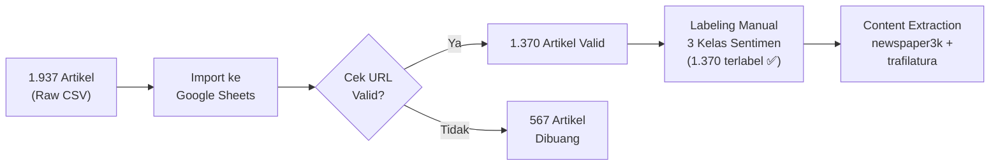
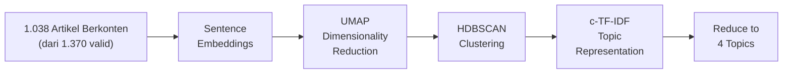
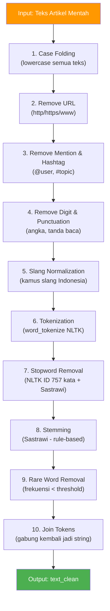

# Pipeline End-to-End: Analisis Sentimen Artikel LPDP

## Daftar Isi

- [Gambaran Umum](#gambaran-umum)
- [Alur Pipeline](#alur-pipeline)
- [Checklist dan Pembagian Tugas](#checklist-dan-pembagian-tugas)
- [Phase 1: Data Collection (Scraping)](#phase-1-data-collection-scraping)
- [Phase 2: Data Validation dan Labeling](#phase-2-data-validation-dan-labeling)
- [Phase 3: Topic Discovery (BERTopic)](#phase-3-topic-discovery-bertopic)
- [Phase 4: Preprocessing](#phase-4-preprocessing)
- [Phase 5: Feature Extraction](#phase-5-feature-extraction)
- [Phase 6: NER (Named Entity Recognition)](#phase-6-ner-named-entity-recognition)
- [Phase 7: POS Tagging (Stanza)](#phase-7-pos-tagging-stanza)
- [Phase 8: Analisis Sentimen Berbasis Leksikon](#phase-8-analisis-sentimen-berbasis-leksikon)
- [Phase 9: Train/Test Split](#phase-9-traintest-split)
- [Phase 10: Model Training](#phase-10-model-training)
- [Phase 11: Evaluation Metrics](#phase-11-evaluation-metrics)
- [Phase 12: Visualization dan Analisis](#phase-12-visualization-dan-analisis)
- [Phase 13: Advanced NLP Tasks (Opsional)](#phase-13-advanced-nlp-tasks-opsional)
- [Tech Stack](#tech-stack)
- [Referensi Notebook](#referensi-notebook)

---

## Gambaran Umum

| Item | Detail |
| :--- | :--- |
| **Tujuan** | Mengklasifikasikan sentimen artikel berita LPDP (Positive / Negative / Neutral) menggunakan teknik NLP |
| **Bahasa** | Indonesia |
| **Sumber Data** | Google News RSS via library GNews |
| **Jumlah Artikel Scraped** | 1.937 artikel |
| **Jumlah Artikel Valid** | 1.370 artikel (setelah validasi URL manual) |
| **Jumlah Artikel Berlabel** | 1.370 artikel (100% dari artikel valid — labeling selesai) |
| **Distribusi Label** | Positive: 462 (33,7%) · Neutral: 506 (36,9%) · Negative: 402 (29,3%) |
| **Jumlah Artikel dengan Konten** | 1.038 artikel ✅ (`dataset_lpdp_konten_raw.csv` — Phase 2 scraping selesai) |
| **Distribusi Label (Scraped)** | Positive: 385 (37,1%) · Neutral: 342 (33,0%) · Negative: 311 (30,0%) |
| **Labeling** | Manual di Google Sheets (3 kelas: Positive, Negative, Neutral) |
| **Output Akhir** | Model klasifikasi sentimen + laporan evaluasi performa |

---

## Alur Pipeline



---

## Checklist dan Pembagian Tugas

### Pembagian PIC per Phase

| PIC | Phase Utama | Tanggung Jawab |
| :--- | :--- | :--- |
| **Iqbal** | Phase 1, 4, 9 | Scraping GNews, preprocessing, train/test split |
| **Amel** | Phase 2, 7, 13 | Validasi URL + labeling manual, POS Tagging, advanced NLP |
| **Celine** | Phase 3, 8, 11 | BERTopic topic discovery, sentimen leksikon, evaluation metrics |
| **Nida** | Phase 6, 12 | NER, visualization dan analisis |
| **Salwa** | Phase 5, 10 | Feature extraction, model training (baseline + IndoBERT) |

### Checklist Detail

- [x] **Phase 1 — Scraping** (PIC: Iqbal)
  - [x] Konfigurasi 20 keywords GNews
  - [x] Jalankan scraping + deduplikasi
  - [x] Export `dataset_lpdp_sorted.csv`
- [X] **Phase 2 — Validasi dan Labeling** (PIC: Amel)
  - [x] Import CSV ke Google Sheets
  - [x] Amel: validasi + labeling baris 2–389 (312/312 valid ✅)
  - [x] Celine: validasi + labeling baris 390–777 (315/315 valid ✅)
  - [x] Iqbal: validasi + labeling baris 778–1164 (332/332 valid ✅)
  - [x] Nida: validasi + labeling baris 1165–1551 (270/270 valid ✅)
  - [x] Salwa: validasi + labeling baris 1552–1938 (335/335 valid ✅)
  - [x] Rekonsiliasi label antar annotator
  - [x] Scraping konten artikel (`newspaper3k`) → **1.038/1.370 artikel berhasil (75,8%)**
  - [x] Export `dataset_lpdp_konten_raw.csv` (Positive: 385 · Neutral: 342 · Negative: 311)
- [x] **Phase 3 — BERTopic** (PIC: Celine)
  - [x] Install BERTopic + sentence-transformers
  - [x] Fit model pada artikel valid
  - [x] Reduce ke 4 topik utama
  - [x] Visualisasi dan interpretasi topik
  - [x] Export artefak final (`bertopic_4_topik_final.xlsx`, `bertopic_topic_info.xlsx`, `bertopic_topic_per_chunk.xlsx`, `bertopic_chunks_data.pkl`)
- [x] **Phase 4 — Preprocessing** (PIC: Iqbal)
  - [x] Implementasi pipeline 10 langkah
  - [x] Buat kamus slang Indonesia (`slang_id.csv`, 114 entri)
  - [x] Validasi output `text_clean` (0 NaN, 0 empty)
  - [x] Export `dataset_lpdp_preprocessed.csv` (1.038 baris)
- [ ] **Phase 5 — Feature Extraction** (PIC: Salwa)
  - [ ] TF-IDF vectorization (n-gram)
  - [ ] Bag of Words baseline
  - [ ] IndoBERT embeddings ([CLS] token)
- [ ] **Phase 6 — NER** (PIC: Nida)
  - [ ] Install transformers + spaCy
  - [ ] Load `cahya/bert-base-indonesian-NER`
  - [ ] Ekstrak entitas (PER, ORG, LOC) dari artikel
  - [ ] Analisis frekuensi entitas per tipe
- [ ] **Phase 7 — POS Tagging** (PIC: Amel)
  - [ ] Install Stanza + download model `id` (~500MB)
  - [ ] POS tagging seluruh artikel dengan Stanza
  - [ ] Analisis distribusi POS tag (NOUN, VERB, ADJ)
- [ ] **Phase 8 — Analisis Sentimen Berbasis Leksikon** (PIC: Celine)
  - [ ] Install TextBlob + download InSet lexicon (positive.tsv, negative.tsv)
  - [ ] Hitung polarity TextBlob per artikel (Content)
  - [ ] Hitung skor InSet per artikel (text_clean)
  - [ ] Evaluasi TextBlob vs label manual
  - [ ] Evaluasi InSet vs label manual
- [ ] **Phase 9 — Train/Test Split** (PIC: Iqbal)
  - [ ] Stratified split 80:20
  - [ ] Verifikasi distribusi label di train dan test
- [ ] **Phase 10 — Model Training** (PIC: Salwa)
  - [ ] Tier 1: Naive Bayes, Logistic Regression, Linear SVC
  - [ ] Tier 2: IndoBERT fine-tuning (5 epoch)
  - [ ] Tier 3 (Opsional): RAG-based data augmentation jika F1 kelas minority < 0.60
- [ ] **Phase 11 — Evaluation** (PIC: Celine)
  - [ ] Classification report per model
  - [ ] Confusion matrix visualization
  - [ ] Perbandingan F1 weighted antar model
- [ ] **Phase 12 — Visualization** (PIC: Nida)
  - [ ] Distribusi sentimen (bar chart)
  - [ ] Word cloud per sentimen
  - [ ] Tren temporal + sentimen per media
- [ ] **Phase 13 — Advanced NLP** (PIC: Amel)
  - [ ] Extractive summarization

---

## Phase 1: Data Collection (Scraping)

### Library

- **GNews** — Python wrapper untuk Google News RSS feed
- Konfigurasi: `language='id'`, `country='ID'`, `max_results=500`

### Strategi 20 Keywords (5 Kategori)

| Kategori | Keywords |
| :--- | :--- |
| **General** | `LPDP`, `Beasiswa+LPDP`, `Program+LPDP` |
| **Aktor** | `Awardee+LPDP`, `Alumni+LPDP`, `Mahasiswa+LPDP`, `Penerima+LPDP` |
| **Konteks** | `Polemik+LPDP`, `Wawancara+LPDP`, `Pendaftar+LPDP`, `Seleksi+LPDP` |
| **Cakupan** | `LPDP+Luar+Negeri`, `LPDP+S2`, `LPDP+S3`, `Kuliah+LPDP` |
| **Waktu** | `LPDP+2024`, `LPDP+2023` |
| **Campuran** | `Dana+LPDP`, `LPDP+Indonesia`, `Scholarship+LPDP` |

### Proses

1. Loop 20 keywords, masing-masing fetch hingga 500 hasil (delay 2 detik antar query)
2. Gabungkan semua hasil ke satu DataFrame
3. **Deduplikasi** berdasarkan kolom `URL_Artikel`
4. Sort berdasarkan `Sumber_Media` dan `Tanggal_Rilis` (terbaru di atas)
5. Export ke CSV

### Output

- File: `dataset_lpdp_sorted.csv`
- Kolom: `Judul`, `Tanggal_Rilis`, `Deskripsi`, `URL_Artikel`, `Sumber_Media`, `Tanggal_Parsed`
- Total: 1.937 artikel (sebelum validasi)

---

## Phase 2: Data Validation dan Labeling

### Mengapa Perlu Validasi?

Dari **1.937 artikel** yang di-scrape, banyak URL yang sudah **mati, redirect, atau duplikat konten**. Proses validasi dilakukan manual di Google Sheets.

### Proses Validasi



### Kriteria Validasi

| Status | Kriteria |
| :--- | :--- |
| **Valid** | URL bisa diakses, konten relevan tentang LPDP, bukan duplikat |
| **Invalid** | URL mati (404/403), redirect ke homepage, konten tidak relevan, video-only |

### Labeling Manual

Setiap artikel yang valid diberi label sentimen berdasarkan **nada keseluruhan** artikel:

| Label | Deskripsi | Contoh Topik |
| :--- | :--- | :--- |
| **Positive** | Artikel bernada positif, apresiatif, atau informatif-netral-positif | Kisah sukses alumni, pembukaan pendaftaran baru |
| **Negative** | Artikel bernada kritis, negatif, atau kontroversial | Polemik paspor, pelanggaran kontrak, kritik publik |
| **Neutral** | Artikel informatif murni tanpa tendensi emosional | Pengumuman resmi, data statistik, FAQ |

### Progress Labeling (Per 20 April 2026)

> ✅ **Status:** Labeling **selesai 100%** — semua artikel valid sudah dilabeli oleh seluruh anggota.

| PIC | Total Baris | Artikel Valid | Terlabel | Positive | Neutral | Negative | Status |
| :--- | :---: | :---: | :---: | :---: | :---: | :---: | :--- |
| **Amel** | 388 | 312 | 312 | 55 | 135 | 122 | ✅ Selesai |
| **Celine** | 388 | 315 | 315 | 81 | 130 | 104 | ✅ Selesai |
| **Iqbal** | 387 | 332 | 332 | 197 | 89 | 46 | ✅ Selesai |
| **Nida** | 387 | 270 | 270 | 122 | 55 | 93 | ✅ Selesai |
| **Salwa** | 387 | 141 | 141 | 7 | 97 | 37 | ✅ Selesai |
| **Total** | **1.937** | **1.370** | **1.370** | **462** | **506** | **402** | ✅ |

### Struktur Data Tervalidasi

File Google Sheets diekspor sebagai CSV dengan kolom berikut. **Hanya baris `Valid? = TRUE`** yang diproses ke fase berikutnya:

| Kolom | Tipe | Keterangan |
| :--- | :--- | :--- |
| `Title` | string | Judul artikel dari Google News |
| `Release Date` | string | Tanggal rilis (format RFC 2822) |
| `URL` | string | Link artikel asli |
| `Publisher` | string | Nama media/publisher |
| `PiC` | string | Anggota yang memvalidasi |
| `Valid?` | boolean | `TRUE` = valid, `FALSE` = tidak valid |
| `Sentiment` | string | Label: `Positive` / `Negative` / `Neutral` |
| `Notes` | string | Catatan tambahan annotator |

**Contoh data valid:**

```text
Title        : Cegah kolusi-nepotisme, program LPDP dinilai perlu perketat seleksi
Release Date : Tue, 03 Mar 2026 04:27:14 GMT
URL          : https://news.google.com/rss/articles/...
Publisher    : ANTARA News
PiC          : Amel
Valid?       : TRUE
Sentiment    : Negative
Notes        :
```

**Load data valid di Python:**

```python
import pandas as pd

df_all = pd.read_csv('Kelompok 5 - Link Artikel LPDP - All.csv')

# Filter hanya artikel valid yang sudah dilabeli
df_valid = df_all[
    (df_all['Valid?'] == True) &
    (df_all['Sentiment'].notna())
].copy().reset_index(drop=True)

print(f"Total valid + terlabel: {len(df_valid)}")
print(df_valid['Sentiment'].value_counts())
```

### Content Extraction (Scraping Isi Artikel)

Google News RSS hanya menyediakan **deskripsi singkat** (1–2 kalimat snippet). Untuk analisis NLP yang mendalam (BERTopic, sentimen, NER), diperlukan **isi lengkap** artikel dari setiap URL valid.

#### Kenapa Perlu Content Extraction?

| Data | Sumber | Panjang Rata-rata | Kualitas untuk NLP |
| :--- | :--- | :--- | :--- |
| `Deskripsi` | Google News RSS snippet | ~20–50 kata | Kurang — terlalu pendek |
| `Content` | Scraping dari URL asli | ~200–1.000 kata | Baik — paragraf lengkap |

#### Library Ekstraksi Konten

| Library | Keunggulan |
| :--- | :--- |
| **newspaper3k** | Otomatis extract judul, teks, tanggal; support multi-bahasa |
| **trafilatura** | Lebih robust untuk edge case (paywall, JS-rendered) |

#### Implementasi Ekstraksi Konten

```python
from newspaper import Article
import time


def extract_article_content(url, lang='id', timeout=10):
    """Extract full article text from URL."""
    try:
        article = Article(url, language=lang, request_timeout=timeout)
        article.download()
        article.parse()
        return article.text if len(article.text) > 50 else None
    except Exception:
        return None


# Scrape konten dari semua artikel valid
contents = []
for idx, url in enumerate(df_valid['URL_Artikel']):
    content = extract_article_content(url)
    contents.append(content)
    if idx % 50 == 0:
        print(f"Progress: {idx}/{len(df_valid)}")
    time.sleep(1)  # Rate limiting: 1 detik antar request

df_valid['Content'] = contents

# Cek coverage
success_rate = df_valid['Content'].notna().mean()
print(f"Content extracted: {success_rate:.1%}")
```

#### Validasi Content

| Metric | Target |
| :--- | :--- |
| **Min length** | ≥ 50 karakter (filter noise) |

```python
# Statistik panjang content
df_valid['content_len'] = df_valid['Content'].str.len()
print(df_valid['content_len'].describe())
```

### Output Phase 2

- Spreadsheet dengan kolom: `Title`, `Release Date`, `URL`, `Publisher`, `PiC`, `Valid?`, `Sentiment`, `Notes`
- Kolom `Content` ditambahkan setelah content extraction selesai
- Dari **1.370 artikel valid**, hanya artikel yang **berhasil di-scrape (punya `Content`)** yang diekspor ke Phase 3
- Artikel tanpa content (scraping gagal) **dikecualikan** dari dataset output
- Dataset output: **`dataset_lpdp_konten_raw.csv`** — **1.038 artikel** dengan konten lengkap (75,8% dari 1.370 valid), siap diproses ke Phase 3

### Distribusi Label (Artikel Valid — 1.370 Total)

| Label | Jumlah | Proporsi |
| :--- | :---: | :---: |
| **Neutral** | 506 | 36,9% |
| **Positive** | 462 | 33,7% |
| **Negative** | 402 | 29,4% |
| **Total berlabel** | **1.370** | **100%** |

### Distribusi Label (Artikel Diekspor — `dataset_lpdp_konten_raw.csv` — 1.038 Total)

| Label | Jumlah | Proporsi |
| :--- | :---: | :---: |
| **Positive** | 385 | 37,1% |
| **Neutral** | 342 | 33,0% |
| **Negative** | 311 | 30,0% |
| **Total diekspor** | **1.038** | **100%** |

> **Catatan:** 332 artikel (24,2%) tidak berhasil di-scrape (URL mati, paywall, timeout) dan dikecualikan dari Phase 3.
> Distribusi label pada dataset yang diekspor sedikit berbeda dari dataset berlabel karena subset yang berhasil di-scrape bukan random sample.

**Implikasi:** Distribusi cukup seimbang antara ketiga kelas (rentang ~7%) — class imbalance ringan, stratified split di Phase 9 dan F1 weighted di Phase 11 tetap direkomendasikan.

---

## Phase 3: Topic Discovery (BERTopic)

### Tujuan

Mengelompokkan **1.038 artikel yang berhasil di-scrape** (dari 1.370 valid) ke dalam **4 topik utama** menggunakan BERTopic untuk memahami tema dominan sebelum analisis sentimen.

### Kenapa BERTopic, Bukan LDA?

| Aspek | LDA (Tradisional) | BERTopic |
| :--- | :--- | :--- |
| **Representasi teks** | Bag-of-words | Contextual embeddings (transformer) |
| **Kualitas topik** | Sering tercampur | Lebih koheren dan interpretable |
| **Bahasa Indonesia** | Terbatas | Didukung via multilingual model |
| **Visualisasi** | Manual (matplotlib) | Built-in (interaktif) |
| **Tuning** | Banyak hyperparameter | Minimal, otomatis |

### Pipeline BERTopic



### Implementasi

```python
from bertopic import BERTopic
from sentence_transformers import SentenceTransformer

# 1. Embedding model multilingual (support Bahasa Indonesia)
embedding_model = SentenceTransformer(
    "sentence-transformers/paraphrase-multilingual-MiniLM-L12-v2"
)

# 2. Inisialisasi BERTopic dengan target 4 topik
topic_model = BERTopic(
    embedding_model=embedding_model,
    nr_topics=4,
    language="indonesian",
    calculate_probabilities=True,
    verbose=True
)

# 3. Fit pada teks artikel valid (gunakan Content, bukan Deskripsi)
docs = df_valid['Content'].tolist()
topics, probs = topic_model.fit_transform(docs)

# 4. Lihat ringkasan topik
print(topic_model.get_topic_info())

# 5. Top words per topik
for topic_id in range(4):
    print(f"\nTopic {topic_id}:")
    print(topic_model.get_topic(topic_id))
```

### Hasil Aktual Notebook 3 (Final)

Notebook 3 telah selesai dijalankan dan menghasilkan model terbaik dengan konfigurasi berikut:

| Komponen | Nilai |
| :--- | :--- |
| **Best model** | `min_cluster_size=150`, `min_samples=5` |
| **Coherence metric** | **C_v = 0.8178** (gensim) |
| **Jumlah artikel input** | 1.038 |
| **Jumlah artikel terlabel topik** | 937 |
| **Unlabeled (NaN)** | 101 |
| **Coverage mapping topik** | 90,2% |

Distribusi 4 label topik final:

| Label Topik Final | Jumlah | Persentase (dari 937 labeled) |
| :--- | :---: | :---: |
| Kebijakan & Prioritas Program | 553 | 59,0% |
| Kewajiban & Sanksi Penerima | 147 | 15,7% |
| Pendaftaran & Seleksi LPDP | 140 | 14,9% |
| Kontroversi Penerima Beasiswa | 97 | 10,4% |

### Visualisasi Topik

```python
# Bar chart: top words per topik
topic_model.visualize_barchart(top_n_topics=4, n_words=10)

# Intertopic Distance Map (kesamaan antar topik)
topic_model.visualize_topics()

# Distribusi probabilitas dokumen ke topik
topic_model.visualize_distribution(probs[0])

# Heatmap similarity antar topik
topic_model.visualize_heatmap()
```

### Output Phase 3

- File utama: `output_bertopic/bertopic_4_topik_final.xlsx` (1.038 baris)
- Metadata topik: `output_bertopic/bertopic_topic_info.xlsx` (19 baris: 18 non-outlier + 1 outlier)
- Mapping chunk ke topik: `output_bertopic/bertopic_topic_per_chunk.xlsx` (6.104 baris)
- Data chunk untuk reload model: `output_bertopic/bertopic_chunks_data.pkl`
- Visualisasi topik tersedia dari notebook untuk kebutuhan laporan akhir
- Insight siap dipakai: distribusi sentimen **per topik** (cross-analysis di Phase 12)

---

## Phase 4: Preprocessing

### Pipeline 10 Langkah



### Detail Tiap Langkah

| Step | Teknik | Library | Contoh |
| :--- | :--- | :--- | :--- |
| 1 | Case folding | Python `str.lower()` | `"Alumni LPDP"` → `"alumni lpdp"` |
| 2 | Remove URL | `re.sub(r'https?://\S+', '')` | Hapus link dalam teks |
| 3 | Remove mention/hashtag | `re.sub(r'[@#]\w+', '')` | `"@kompas #LPDP"` → `""` |
| 4 | Remove digit & punctuation | `re.sub`, `string.punctuation` | `"tahun 2024!"` → `"tahun"` |
| 5 | Slang normalization | Kamus custom (CSV) | `"gak"` → `"tidak"`, `"bgt"` → `"banget"` |
| 6 | Tokenization | `nltk.word_tokenize()` | `"alumni lpdp sukses"` → `["alumni", "lpdp", "sukses"]` |
| 7 | Stopword removal | NLTK Indonesian (757 kata) + Sastrawi | Hapus: `"yang"`, `"dan"`, `"di"`, `"ini"` |
| 8 | Stemming | `Sastrawi.StemmerFactory` | `"pendidikan"` → `"didik"`, `"penerima"` → `"terima"` |
| 9 | Rare word removal | Frequency threshold (< 2) | Hapus kata yang muncul hanya 1× di seluruh korpus |
| 10 | Join tokens | `' '.join(tokens)` | `["alumni", "lpdp"]` → `"alumni lpdp"` |

### Catatan untuk Bahasa Indonesia

- **Sastrawi** lebih cocok daripada Porter/Snowball karena memahami morfologi Indonesia (imbuhan me-, di-, ke-an, pe-an, dll.)
- **Slang dictionary** penting karena artikel berita sering mengutip komentar netizen yang mengandung bahasa informal
- **Stopword list** perlu di-augment dengan domain-specific stopwords jika ditemukan noise berulang

### Hasil Aktual Notebook 4 (Final)

Notebook 4 telah selesai disiapkan end-to-end dan output preprocessing sudah dihasilkan:

| Item | Hasil |
| :--- | :--- |
| Input preprocessing | `output_bertopic/bertopic_4_topik_final.xlsx` (1.038 artikel) |
| Output preprocessing | `dataset_lpdp_preprocessed.csv` (1.038 baris) |
| Kolom utama output | `text_clean` |
| Validasi `text_clean` | 0 NaN, 0 empty string |
| Kamus slang | `slang_id.csv` (114 entri) |
| Status siap lanjut | ✅ Siap untuk Phase 5 (Feature Extraction) |

---

## Phase 5: Feature Extraction

### Pendekatan yang Digunakan

#### A. TF-IDF (Term Frequency - Inverse Document Frequency)

> **Rekomendasi utama** untuk baseline model (SVM, Logistic Regression, Naive Bayes)

```python
from sklearn.feature_extraction.text import TfidfVectorizer

tfidf = TfidfVectorizer(
    max_features=5000,      # Batasi fitur
    ngram_range=(1, 2),     # Unigram + Bigram
    min_df=2,               # Minimal muncul di 2 dokumen
    max_df=0.95,            # Abaikan kata yang muncul di 95%+ dokumen
    sublinear_tf=True       # Logarithmic TF scaling
)
X_tfidf = tfidf.fit_transform(df['text_clean'])
```

**Keunggulan:** Cepat, interpretable, proven untuk klasifikasi teks Indonesia.

#### B. Bag of Words (BoW)

> Baseline paling sederhana untuk perbandingan

```python
from sklearn.feature_extraction.text import CountVectorizer

bow = CountVectorizer(max_features=5000, ngram_range=(1, 2))
X_bow = bow.fit_transform(df['text_clean'])
```

#### C. IndoBERT Embeddings

> **Rekomendasi untuk advanced model** — contextual embeddings dari pre-trained transformer

```python
from transformers import AutoTokenizer, AutoModel
import torch

model_name = "indobenchmark/indobert-base-p1"
tokenizer = AutoTokenizer.from_pretrained(model_name)
model = AutoModel.from_pretrained(model_name)

# Encode teks → ambil [CLS] token sebagai representasi dokumen
inputs = tokenizer(text, return_tensors="pt", truncation=True, max_length=512)
with torch.no_grad():
    outputs = model(**inputs)
embedding = outputs.last_hidden_state[:, 0, :]  # [CLS] token
```

### Perbandingan Pendekatan

| Aspek | TF-IDF | BoW | IndoBERT |
| :--- | :--- | :--- | :--- |
| **Kecepatan** | Cepat | Sangat cepat | Lambat (perlu GPU) |
| **Konteks** | Tidak (bag-of-words) | Tidak | Ya (contextual) |
| **Interpretability** | Tinggi | Tinggi | Rendah |
| **Akurasi** | Baik | Cukup | Terbaik |
| **Cocok untuk** | SVM, LR, NB | Baseline | Fine-tuning / transfer learning |

---

## Phase 6: NER (Named Entity Recognition)

### Tujuan

Mengidentifikasi entitas bernama (**orang, organisasi, lokasi**) dalam setiap artikel LPDP untuk memahami aktor dan konteks yang dominan dalam pemberitaan.

### Library

| Library | Model/Package | Kegunaan |
| :--- | :--- | :--- |
| **Transformers** (HuggingFace) | `cahya/bert-base-indonesian-NER` | NER Bahasa Indonesia (BERT-based) |
| **spaCy** | `en_core_web_sm` | NER Bahasa Inggris + custom `EntityRuler` |

### Tipe Entitas (Skema IndoBERT-NER)

| Label | Tipe | Contoh |
| :--- | :--- | :--- |
| `PER` | Person | `Jokowi`, `Direktur LPDP`, `Alumni LPDP` |
| `ORG` | Organization | `LPDP`, `Kemenkeu`, `Universitas Indonesia`, `MIT` |
| `LOC` | Location | `Jakarta`, `Indonesia`, `Amerika Serikat` |

### Implementasi

```python
# pip install transformers sentencepiece spacy
# python -m spacy download en_core_web_sm

from transformers import pipeline

# Load model NER bahasa Indonesia
ner_pipeline = pipeline(
    "ner",
    model="cahya/bert-base-indonesian-NER",
    tokenizer="cahya/bert-base-indonesian-NER",
    aggregation_strategy="simple"
)

def extract_entities(text):
    """Extract named entities dari satu artikel."""
    results = ner_pipeline(str(text)[:512])  # BERT max 512 token
    return [
        {
            "entity": r["entity_group"],
            "word": r["word"],
            "score": round(r["score"], 3)
        }
        for r in results
    ]

# Apply ke seluruh artikel valid
df_valid["entities"] = df_valid["Content"].apply(extract_entities)

# Contoh output
sample = extract_entities(
    "Alumni LPDP dari Universitas Indonesia mendapat beasiswa S2 di MIT, Boston."
)
print(sample)
# [{'entity': 'PER', 'word': 'Alumni LPDP', 'score': 0.991},
#  {'entity': 'ORG', 'word': 'Universitas Indonesia', 'score': 0.987},
#  {'entity': 'ORG', 'word': 'MIT', 'score': 0.979},
#  {'entity': 'LOC', 'word': 'Boston', 'score': 0.965}]
```

### Analisis Frekuensi Entitas

```python
from collections import Counter
import pandas as pd

# Flatten semua entitas ke satu list
all_entities = [
    (ent["entity"], ent["word"])
    for ents in df_valid["entities"]
    for ent in ents
]

# Distribusi tipe entitas
ent_types = [etype for etype, _ in all_entities]
print("Distribusi tipe entitas:")
print(Counter(ent_types))

# Top-20 organisasi yang paling sering disebut
orgs = [word for etype, word in all_entities if etype == "ORG"]
print("\nTop-20 Organisasi:")
print(Counter(orgs).most_common(20))

# Top-20 lokasi
locs = [word for etype, word in all_entities if etype == "LOC"]
print("\nTop-20 Lokasi:")
print(Counter(locs).most_common(20))
```

### Output Phase 6

- Kolom `entities` di DataFrame: list of dicts `{entity, word, score}` per artikel
- Tabel frekuensi entitas per tipe (ORG, PER, LOC)
- Insight: organisasi dan tokoh paling dominan dalam pemberitaan LPDP (input untuk Visualisasi di Phase 12)

---

## Phase 7: POS Tagging (Stanza)

### Tujuan

Menandai kelas kata (**NOUN, VERB, ADJ, dll.**) pada setiap token untuk memahami distribusi linguistik artikel LPDP.

### POS Tagging dengan Stanza

#### Kenapa Stanza?

Stanza (Stanford NLP) mendukung Bahasa Indonesia secara resmi dengan model terlatih dari **UD Indonesian GSD corpus**, sementara NLTK tidak memiliki model POS bahasa Indonesia.

```python
# pip install stanza
import stanza

# Download model bahasa Indonesia (sekali saja, ~500MB)
stanza.download('id', processors='tokenize,pos')

# Load pipeline
nlp_stanza = stanza.Pipeline('id', processors='tokenize,pos', use_gpu=False)

def get_pos_tags(text):
    """Dapatkan POS tag dari teks Bahasa Indonesia."""
    doc = nlp_stanza(str(text)[:2000])  # Batasi panjang teks
    return [
        (word.text, word.upos)
        for sent in doc.sentences
        for word in sent.words
    ]

# Contoh
tags = get_pos_tags(
    "Mahasiswa penerima beasiswa LPDP berhasil lulus dari universitas ternama."
)
print(tags)
# [('Mahasiswa', 'NOUN'), ('penerima', 'NOUN'), ('beasiswa', 'NOUN'),
#  ('LPDP', 'PROPN'), ('berhasil', 'VERB'), ('lulus', 'VERB'),
#  ('dari', 'ADP'), ('universitas', 'NOUN'), ('ternama', 'ADJ')]
```

#### Analisis Distribusi POS

```python
from collections import Counter

# Hitung distribusi POS tag dari seluruh artikel
all_tags = [
    upos
    for text in df_valid["Content"].dropna()
    for _, upos in get_pos_tags(text)
]
pos_dist = Counter(all_tags)
print("Distribusi POS:")
print(pos_dist.most_common(10))

# Ekstrak semua adjektiva (kata sifat) → indikasi sentimen
adj_tokens = [
    word
    for text in df_valid["Content"].dropna()
    for word, upos in get_pos_tags(text)
    if upos == "ADJ"
]
print("\nTop-20 Adjektiva:")
print(Counter(adj_tokens).most_common(20))
```

### Output Phase 7

- Kolom `pos_tags`: list (token, POS_label) per artikel
- Tabel distribusi POS tag (NOUN, VERB, ADJ, PROPN, dll.)
- Top-20 adjektiva dominan → bahan tambahan untuk Word Cloud di Phase 12

---

## Phase 8: Analisis Sentimen Berbasis Leksikon

### Tujuan

Dua pendekatan leksikon sebagai **baseline** sebelum model ML di Phase 10:

1. **TextBlob** — leksikon Bahasa Inggris (mengenali kata serapan dan istilah formal)
2. **InSet** — *Indonesian Sentiment Lexicon* (leksikon Bahasa Indonesia, lebih relevan untuk teks lokal)

> ⚠️ **Catatan:** Keduanya bersifat rule-based, bukan model ML. Hasil digunakan untuk mengukur **gap baseline vs model** di Phase 10. Untuk akurasi produksi, gunakan `indobenchmark/indobert-base-p1` (Phase 10).

---

### A. TextBlob (English Lexicon)

#### Implementasi

```python
# pip install textblob
from textblob import TextBlob

def analyze_sentiment_textblob(text):
    """
    Polarity: -1.0 (sangat negatif) hingga +1.0 (sangat positif)
    Threshold: > 0.05 = Positive, < -0.05 = Negative, else Neutral
    """
    blob = TextBlob(str(text))
    polarity = blob.sentiment.polarity

    if polarity > 0.05:
        label = "Positive"
    elif polarity < -0.05:
        label = "Negative"
    else:
        label = "Neutral"

    return {"polarity": round(polarity, 4), "label": label}

df_valid["textblob_result"] = df_valid["Content"].apply(analyze_sentiment_textblob)
df_valid["textblob_polarity"] = df_valid["textblob_result"].apply(lambda x: x["polarity"])
df_valid["textblob_label"] = df_valid["textblob_result"].apply(lambda x: x["label"])

print(df_valid["textblob_label"].value_counts())
```

#### Evaluasi vs Label Manual

```python
from sklearn.metrics import classification_report

df_labeled = df_valid[df_valid["Sentiment"].notna()].copy()

print("=== TextBlob vs Label Manual ===")
print(classification_report(
    df_labeled["Sentiment"],
    df_labeled["textblob_label"],
    target_names=["Negative", "Neutral", "Positive"]
))
# Ekspektasi: akurasi rendah (~40-55%) — TextBlob tidak dirancang untuk Bahasa Indonesia
```

---

### B. InSet — Indonesian Sentiment Lexicon

**InSet** (Salsabila et al., 2018) adalah leksikon sentimen Bahasa Indonesia berisi kata positif dan negatif beserta bobot numeriknya. Lebih relevan dari TextBlob untuk teks berbahasa Indonesia.

#### Setup Lexicon

```python
import pandas as pd
import urllib.request

# Download InSet dari GitHub (fajri91/InSet)
urllib.request.urlretrieve(
    "https://raw.githubusercontent.com/fajri91/InSet/master/positive.tsv",
    "inset_positive.tsv"
)
urllib.request.urlretrieve(
    "https://raw.githubusercontent.com/fajri91/InSet/master/negative.tsv",
    "inset_negative.tsv"
)

pos_df = pd.read_csv("inset_positive.tsv", sep="\t", header=None, names=["word", "weight"])
neg_df = pd.read_csv("inset_negative.tsv", sep="\t", header=None, names=["word", "weight"])

pos_dict = dict(zip(pos_df["word"], pos_df["weight"]))
neg_dict = dict(zip(neg_df["word"], neg_df["weight"]))
```

#### Implementasi

```python
def analyze_sentiment_inset(text):
    words = str(text).lower().split()
    pos_score = sum(pos_dict.get(w, 0) for w in words)
    neg_score = sum(neg_dict.get(w, 0) for w in words)
    total_score = pos_score - neg_score

    if total_score > 0:
        label = "Positive"
    elif total_score < 0:
        label = "Negative"
    else:
        label = "Neutral"

    return {"inset_score": round(total_score, 4), "label": label}

# Gunakan text_clean (sudah preprocessed di Phase 4)
df_valid["inset_result"] = df_valid["text_clean"].apply(analyze_sentiment_inset)
df_valid["inset_score"] = df_valid["inset_result"].apply(lambda x: x["inset_score"])
df_valid["inset_label"] = df_valid["inset_result"].apply(lambda x: x["label"])

print(df_valid["inset_label"].value_counts())
```

#### Evaluasi vs Label Manual

```python
print("=== InSet vs Label Manual ===")
print(classification_report(
    df_labeled["Sentiment"],
    df_labeled["inset_label"],
    target_names=["Negative", "Neutral", "Positive"]
))
# Ekspektasi: lebih baik dari TextBlob untuk Bahasa Indonesia (~55-70%)
```

---

### Perbandingan Dua Metode

```python
comparison = pd.DataFrame({
    "TextBlob": df_valid["textblob_label"].value_counts(),
    "InSet": df_valid["inset_label"].value_counts()
})
print(comparison)
```

### Output Phase 8

- Kolom `textblob_polarity`, `textblob_label` — baseline English lexicon
- Kolom `inset_score`, `inset_label` — baseline leksikon Bahasa Indonesia
- Classification report TextBlob vs label manual
- Classification report InSet vs label manual
- Tabel perbandingan distribusi kedua metode
- Insight: InSet > TextBlob untuk teks Bahasa Indonesia; keduanya masih di bawah model ML (Phase 10)

---

## Phase 9: Train/Test Split

### Mengapa Perlu Split?

- **Tanpa split** → model dievaluasi pada data yang sama dengan training → **overfitting**, metrik tidak reliable
- **Dengan split** → evaluasi pada data yang belum pernah dilihat model → estimasi performa di dunia nyata

### Strategi Split

```python
from sklearn.model_selection import train_test_split

X_train, X_test, y_train, y_test = train_test_split(
    X,                    # Fitur (TF-IDF / BoW / embeddings)
    y,                    # Label sentimen
    test_size=0.2,        # 20% untuk testing
    random_state=42,      # Reproducibility
    stratify=y            # PENTING: jaga proporsi label
)
```

### Keputusan: Pakai Semua 1.370 Artikel (Tanpa Undersampling)

Imbalance antar kelas hanya ~7% (selisih Neutral vs Negative) — termasuk kategori **ringan**. Undersampling ke 400×3 = 1.200 akan membuang 169 artikel berlabel yang sudah valid. Tidak worth it.

**Strategi yang dipilih:** Pakai semua 1.370, evaluasi dengan `f1_weighted` agar bobot tiap kelas proporsional.

> Semua 1.370 artikel berlabel terpakai — **1.096 untuk training** (model belajar dari pasangan teks→label) dan **274 untuk testing** (prediksi dibandingkan label asli → F1, accuracy, confusion matrix).

### Kenapa Stratified?

Karena proporsi label sedikit berbeda antar kelas, perlu dijaga konsisten di train dan test:

```text
Distribusi sebelum split (data aktual):
  Neutral  : 506 (36,9%)  →  Train: ~405  |  Test: ~101
  Positive : 462 (33,7%)  →  Train: ~370  |  Test:  ~92
  Negative : 402 (29,3%)  →  Train: ~322  |  Test:  ~80
  ─────────────────────────────────────────────────
  Total    : 1.370        →  Train: 1.096  |  Test:  274

Tanpa stratify → Test set bisa kebetulan berisi >40% Neutral → evaluasi misleading
Dengan stratify → Proporsi 36,9:33,7:29,3 terjaga di train DAN test
```

### Cross-Validation (Opsional tapi Direkomendasikan)

```python
from sklearn.model_selection import StratifiedKFold, cross_val_score

skf = StratifiedKFold(n_splits=5, shuffle=True, random_state=42)
scores = cross_val_score(model, X_train, y_train, cv=skf, scoring='f1_weighted')
print(f"CV F1 (weighted): {scores.mean():.4f} ± {scores.std():.4f}")
```

**Kenapa 5-Fold CV?**

- Memberikan estimasi performa yang lebih stabil
- Memanfaatkan semua data training untuk validasi (setiap fold jadi validation set sekali)
- Mendeteksi apakah model overfit ke split tertentu

---

## Phase 10: Model Training

### Tier 1: Baseline Models (Classical ML + TF-IDF)

| Model | Library | Karakteristik |
| :--- | :--- | :--- |
| **Multinomial Naive Bayes** | `sklearn.naive_bayes` | Cepat, cocok untuk sparse features, baseline yang solid |
| **Logistic Regression** | `sklearn.linear_model` | Interpretable, performa stabil, regularization built-in |
| **Linear SVC** | `sklearn.svm` | Biasanya **terbaik** untuk klasifikasi teks dengan TF-IDF |

```python
from sklearn.naive_bayes import MultinomialNB
from sklearn.linear_model import LogisticRegression
from sklearn.svm import LinearSVC

models = {
    'Naive Bayes': MultinomialNB(alpha=1.0),
    'Logistic Regression': LogisticRegression(
        C=1.0, max_iter=1000, class_weight='balanced'
    ),
    'Linear SVC': LinearSVC(
        C=1.0, max_iter=1000, class_weight='balanced'
    )
}

for name, model in models.items():
    model.fit(X_train, y_train)
    y_pred = model.predict(X_test)
    print(f"\n{name}")
    print(classification_report(y_test, y_pred))
```

> **`class_weight='balanced'`** — otomatis menyesuaikan bobot kelas yang under-represented. Penting untuk menangani imbalance Neutral vs Positive/Negative.

### Tier 2: Advanced Model (IndoBERT Fine-Tuning)

```python
from transformers import (
    AutoTokenizer,
    AutoModelForSequenceClassification,
    Trainer,
    TrainingArguments
)

model_name = "indobenchmark/indobert-base-p1"
tokenizer = AutoTokenizer.from_pretrained(model_name)
model = AutoModelForSequenceClassification.from_pretrained(
    model_name,
    num_labels=3  # Positive, Negative, Neutral
)

training_args = TrainingArguments(
    output_dir="./results",
    num_train_epochs=5,
    per_device_train_batch_size=16,
    per_device_eval_batch_size=32,
    learning_rate=2e-5,
    weight_decay=0.01,
    eval_strategy="epoch",
    save_strategy="epoch",
    load_best_model_at_end=True,
    metric_for_best_model="f1_weighted"
)

trainer = Trainer(
    model=model,
    args=training_args,
    train_dataset=train_dataset,
    eval_dataset=eval_dataset,
    compute_metrics=compute_metrics
)

trainer.train()
```

### Tier 3: RAG-based Data Augmentation (Opsional)

> **Kapan digunakan:** Jalankan Tier 1 dan Tier 2 lebih dulu. Jika F1 salah satu kelas (biasanya `Negative`) < 0.60, gunakan augmentasi ini untuk menyeimbangkan training set.

#### Konsep

Gunakan LLM untuk **generate artikel sintetis** pada kelas minoritas. Artikel nyata yang sudah berlabel digunakan sebagai contoh gaya penulisan (few-shot via retrieval).

```text
Kelas minority (Negative = 311)
      ↓
Retrieve 3-5 artikel Negative yang mirip topik (via FAISS similarity search)
      ↓
Prompt LLM: "Buat artikel baru tentang LPDP dengan sentimen Negative
             berdasarkan gaya artikel berikut: [contoh retrieved]..."
      ↓
Generate artikel sintetis berlabel Negative
      ↓
Tambahkan ke X_train → training set lebih seimbang
```

#### Target Augmentasi

| Label | Asli | Target | Perlu Generate |
| :--- | :---: | :---: | :---: |
| Positive | 385 | 385 | 0 |
| Neutral | 342 | 385 | ~43 |
| Negative | 311 | 385 | ~74 |

#### Implementasi

```python
import faiss
import numpy as np
from sentence_transformers import SentenceTransformer
from openai import OpenAI  # atau Gemini / Ollama

# 1. Embed semua artikel training
embedder = SentenceTransformer("sentence-transformers/paraphrase-multilingual-MiniLM-L12-v2")
train_embeddings = embedder.encode(X_train_texts, show_progress_bar=True)

# 2. Bangun FAISS index untuk retrieval
index = faiss.IndexFlatL2(train_embeddings.shape[1])
index.add(train_embeddings.astype('float32'))

def retrieve_examples(query_text, label, k=3):
    """Retrieve K artikel training dengan label tertentu yang paling mirip."""
    query_emb = embedder.encode([query_text]).astype('float32')
    _, indices = index.search(query_emb, k * 5)  # ambil lebih, filter by label
    candidates = [(X_train_texts[i], y_train[i]) for i in indices[0]]
    return [text for text, lbl in candidates if lbl == label][:k]

# 3. Generate artikel sintetis via LLM
client = OpenAI()  # set OPENAI_API_KEY di environment

def generate_augmented_article(label, retrieved_examples):
    """Generate 1 artikel sintetis untuk kelas `label`."""
    examples_str = "\n\n---\n\n".join(
        [f"Contoh {i+1}:\n{ex[:300]}" for i, ex in enumerate(retrieved_examples)]
    )
    prompt = f"""Kamu adalah jurnalis Indonesia. Tulis 1 artikel berita tentang LPDP 
dengan sentimen {label} (sekitar 150-250 kata, dalam Bahasa Indonesia).

Gunakan gaya penulisan serupa dengan contoh berikut:
{examples_str}

Artikel baru:"""

    response = client.chat.completions.create(
        model="gpt-4o-mini",
        messages=[{"role": "user", "content": prompt}],
        max_tokens=400,
        temperature=0.8
    )
    return response.choices[0].message.content.strip()

# 4. Augmentasi kelas yang under-represented
target_count = max(pd.Series(y_train).value_counts())
augmented_texts, augmented_labels = [], []

for label in ['Neutral', 'Negative']:
    current_count = sum(1 for y in y_train if y == label)
    needed = target_count - current_count
    print(f"Generating {needed} artikel untuk kelas '{label}'...")

    for _ in range(needed):
        # Retrieve contoh artikel kelas ini
        seed_text = X_train_texts[y_train.index(label)]  # ambil satu contoh
        examples = retrieve_examples(seed_text, label, k=3)
        new_article = generate_augmented_article(label, examples)
        augmented_texts.append(new_article)
        augmented_labels.append(label)

# 5. Gabungkan ke training set
X_train_augmented = X_train_texts + augmented_texts
y_train_augmented = y_train + augmented_labels

print(f"Training set setelah augmentasi: {len(X_train_augmented)}")
print(pd.Series(y_train_augmented).value_counts())
```

> **Penting:** Augmentasi **hanya diterapkan pada training set**. Test set tetap menggunakan data asli agar evaluasi fair.

### Perbandingan Ekspektasi Performa

| Model | Estimasi F1 (weighted) | Waktu Training | Hardware |
| :--- | :--- | :--- | :--- |
| Naive Bayes + TF-IDF | 0.65 - 0.75 | Detik | CPU |
| Logistic Regression + TF-IDF | 0.70 - 0.80 | Detik | CPU |
| Linear SVC + TF-IDF | 0.72 - 0.82 | Detik | CPU |
| IndoBERT Fine-Tuned | 0.80 - 0.90 | 30-60 menit | GPU (direkomendasikan) |
| IndoBERT + RAG Augmentation | 0.82 - 0.92 | 30-60 menit | GPU (direkomendasikan) |

---

## Phase 11: Evaluation Metrics

### Metrik Utama

| Metrik | Formula | Interpretasi |
| :--- | :--- | :--- |
| **Accuracy** | $\frac{TP + TN}{Total}$ | Proporsi prediksi yang benar secara keseluruhan |
| **Precision** | $\frac{TP}{TP + FP}$ | Dari yang diprediksi kelas X, berapa yang benar? |
| **Recall** | $\frac{TP}{TP + FN}$ | Dari semua data kelas X, berapa yang terdeteksi? |
| **F1-Score** | $\frac{2 \times P \times R}{P + R}$ | Harmonic mean antara Precision dan Recall |

### Kenapa F1-Score Weighted?

Karena dataset **imbalanced** (Neutral dominan), accuracy saja bisa misleading:

```text
Contoh: 100 data test → 55 Neutral, 27 Negative, 18 Positive

Model bodoh yang SELALU prediksi "Neutral":
  Accuracy = 55/100 = 55% → "Lumayan"?
  F1 Positive = 0%
  F1 Negative = 0%
  F1 Weighted = rendah → Ekspos kelemahan model
```

**F1 Weighted** memberikan bobot berdasarkan jumlah sampel tiap kelas, sehingga kelas minoritas tetap diperhitungkan.

### Confusion Matrix

```python
from sklearn.metrics import (
    classification_report,
    confusion_matrix,
    ConfusionMatrixDisplay
)

# Classification Report (per-class P, R, F1)
print(classification_report(
    y_test, y_pred,
    target_names=['Negative', 'Neutral', 'Positive']
))

# Confusion Matrix Visual
cm = confusion_matrix(y_test, y_pred, labels=['Negative', 'Neutral', 'Positive'])
disp = ConfusionMatrixDisplay(cm, display_labels=['Negative', 'Neutral', 'Positive'])
disp.plot(cmap='Blues')
```

### Interpretasi Confusion Matrix (Contoh)

```text
                 Predicted
              Neg   Neu   Pos
Actual Neg  [ 45    12     3 ]   ← 45 benar, 15 salah klasifikasi
Actual Neu  [  8   105     7 ]   ← 105 benar
Actual Pos  [  2     5    33 ]   ← 33 benar

Baca per baris: "Dari 60 artikel Negative, 45 berhasil diprediksi benar"
Baca per kolom: "Dari 55 yang diprediksi Negative, 45 memang benar Negative"
```

### Metrik Tambahan

| Metrik | Kegunaan |
| :--- | :--- |
| **Macro F1** | Rata-rata F1 semua kelas (tanpa bobot) — sensitif terhadap kelas minoritas |
| **Cohen's Kappa** | Mengukur agreement di atas chance — lebih informatif dari accuracy untuk multiclass |
| **ROC-AUC (One-vs-Rest)** | Kemampuan discriminasi model per kelas |

---

## Phase 12: Visualization dan Analisis

### A. Distribusi Sentimen

```python
import matplotlib.pyplot as plt
import seaborn as sns

sns.countplot(data=df, x='Sentiment', order=['Positive', 'Neutral', 'Negative'],
              palette=['#4CAF50', '#2196F3', '#F44336'])
plt.title('Distribusi Sentimen Artikel LPDP')
plt.ylabel('Jumlah Artikel')
```

### B. Word Cloud per Sentimen

```python
from wordcloud import WordCloud

for sentiment in ['Positive', 'Negative', 'Neutral']:
    text = ' '.join(df[df['Sentiment'] == sentiment]['text_clean'])
    wc = WordCloud(width=800, height=400, background_color='white').generate(text)
    plt.figure(figsize=(10, 5))
    plt.imshow(wc, interpolation='bilinear')
    plt.title(f'Word Cloud - {sentiment}')
    plt.axis('off')
```

### C. Top Keywords per Kelas (TF-IDF)

Ekstrak 10 kata dengan skor TF-IDF tertinggi per kelas sentimen untuk memahami kata-kata pembeda antar kelas.

### D. Tren Sentimen Temporal

```python
df['month'] = df['Tanggal_Parsed'].dt.to_period('M')
trend = df.groupby(['month', 'Sentiment']).size().unstack(fill_value=0)
trend.plot(kind='line', marker='o', figsize=(12, 5))
plt.title('Tren Sentimen Artikel LPDP per Bulan')
plt.ylabel('Jumlah Artikel')
```

### E. Sentimen per Sumber Media

```python
media_sentiment = pd.crosstab(df['Sumber_Media'], df['Sentiment'], normalize='index')
media_sentiment.plot(kind='barh', stacked=True, figsize=(10, 8),
                     color=['#F44336', '#2196F3', '#4CAF50'])
plt.title('Proporsi Sentimen per Sumber Media')
```

---

## Phase 13: Advanced NLP Tasks (Opsional)

> **Catatan:** Named Entity Recognition (NER) telah dipindahkan ke **Phase 6** sebagai fase wajib pipeline. Phase 13 ini berfokus pada tugas opsional tambahan.

### A. Topic Modeling

> Sudah dicakup secara mendalam di **Phase 3 (BERTopic)** menggunakan contextual embeddings. Lihat [Phase 3: Topic Discovery](#phase-3-topic-discovery-bertopic) untuk implementasi lengkap.

### B. Extractive Summarization

Meringkas artikel panjang menggunakan metode TF-IDF sentence scoring.

```python
# Hitung TF-IDF per kalimat → score → ambil top-N kalimat sebagai ringkasan
sentences = nltk.sent_tokenize(article_text)
sentence_scores = tfidf_sentence_scoring(sentences)
summary = select_top_sentences(sentence_scores, ratio=0.3)
```

---

## Tech Stack

### Libraries

| Kategori | Library | Versi |
| :--- | :--- | :--- |
| **Scraping** | GNews, newspaper3k, trafilatura | Latest |
| **Data** | pandas, numpy | Latest |
| **Preprocessing** | NLTK, Sastrawi, regex | Latest |
| **Feature Extraction** | scikit-learn (TfidfVectorizer) | Latest |
| **ML Models** | scikit-learn (SVM, LR, NB) | Latest |
| **Deep Learning** | transformers, torch | Latest |
| **Topic Modeling** | BERTopic, sentence-transformers, UMAP, HDBSCAN | Latest |
| **NER** | spaCy, transformers (cahya/bert-base-indonesian-NER) | Latest |
| **POS Tagging** | Stanza (Indonesian model) | Latest |
| **Analisis Sentimen Leksikon** | TextBlob, InSet | Latest |
| **Visualization** | matplotlib, seaborn, wordcloud | Latest |

### Pre-trained Models

| Model | Kegunaan | Source |
| :--- | :--- | :--- |
| `indobenchmark/indobert-base-p1` | Fine-tuning klasifikasi sentimen | HuggingFace |
| `cahya/bert-base-indonesian-NER` | Named Entity Recognition Indonesia | HuggingFace |
| `stanza` (id model) | POS Tagging Bahasa Indonesia | Stanford NLP |

### Hardware Requirement

| Task | Minimum | Rekomendasi |
| :--- | :--- | :--- |
| Preprocessing + Baseline ML | CPU, 4GB RAM | CPU, 8GB RAM |
| IndoBERT Fine-Tuning | GPU 4GB VRAM | GPU 8GB+ VRAM (T4/V100) |

---

## Referensi Notebook

| Notebook | Relevansi |
| :--- | :--- |
| `Project A/ScrappingArtikelLPDP.ipynb` | Kode scraping 20 keywords |
| `Week 2/Preprocessing.ipynb` | Pipeline preprocessing 10 langkah |
| `Week 3/Tugas1C_LPDP_Article_Summarization.ipynb` | Summarization TF-IDF pada artikel LPDP |
| `Week 4/Tugas1_TFIDF_SentimentClassification.ipynb` | TF-IDF + model klasifikasi sentimen |
| `Week 6/SentimentAnalysis.ipynb` | Sentiment analysis dengan TextBlob + visualisasi |
| `Week 6/NER.ipynb` | NER dengan spaCy dan IndoBERT |
| `Week 6/POSTagging.ipynb` | POS Tagging dengan Stanza (Bahasa Indonesia) |
| `Week 6/Clustering.ipynb` | KMeans clustering + TF-IDF |
| `Week 7/Week7_NER_HonestReview.ipynb` | NER pada dataset review Indonesia |
